# Flowchart Model Geometri

File ini berisi flowchart detail berdasarkan kode pada folder `src/pElips/model`.
Format diagram menggunakan Mermaid agar mudah ditempel ke Markdown, dokumentasi, atau editor yang mendukung Mermaid.

## Relasi Pewarisan Class

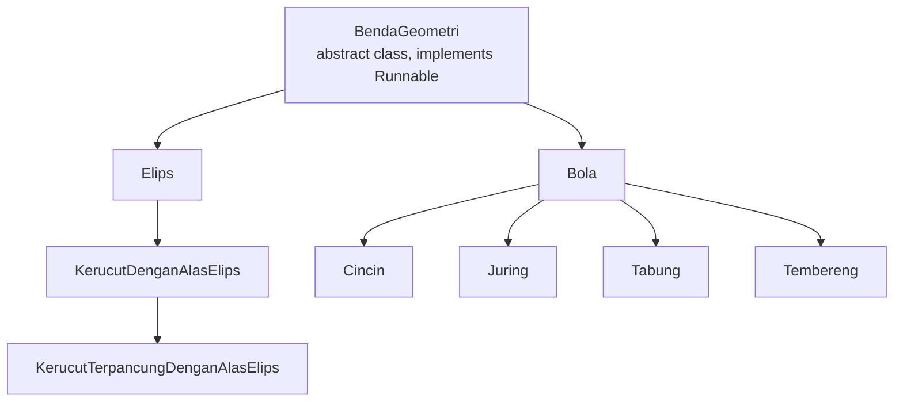

Catatan:
- Semua class turunan memakai alur thread dari `BendaGeometri.run()`.
- Method `run()` pada class turunan hanya memanggil `super.run()`.
- Method `hitungSemua()` selalu memanggil `hitungLuas()`, `hitungKeliling()`, lalu `hitungVolume()` sesuai implementasi class masing-masing.

---

## 1. BendaGeometri.java

### Alur Constructor dan Validasi Nama

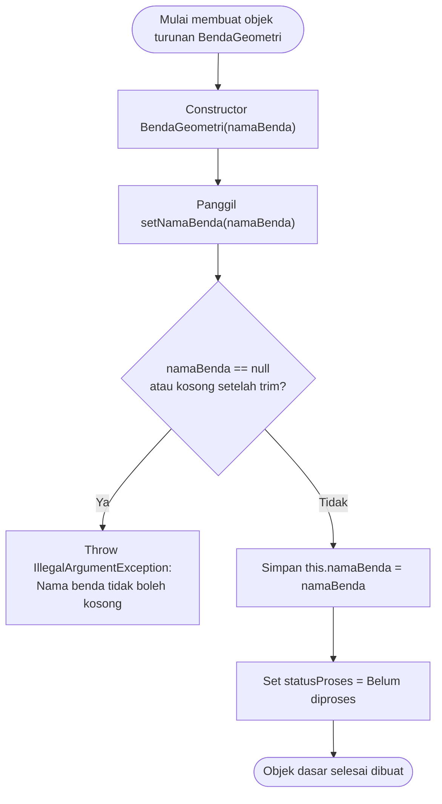

### Alur hitungSemua()

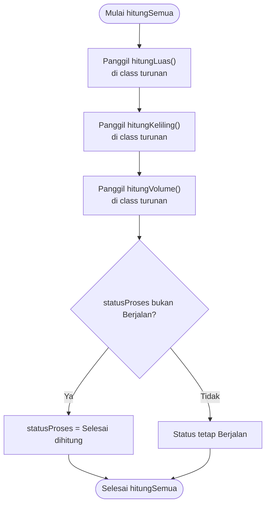

### Alur run() untuk Multithreading

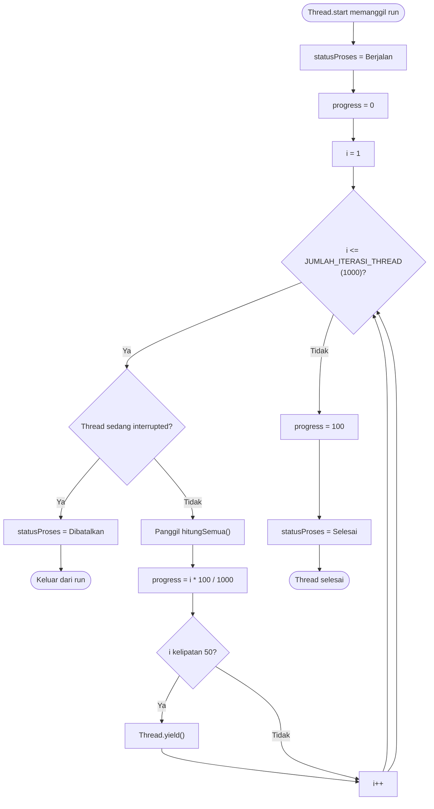

### Alur Utility Method

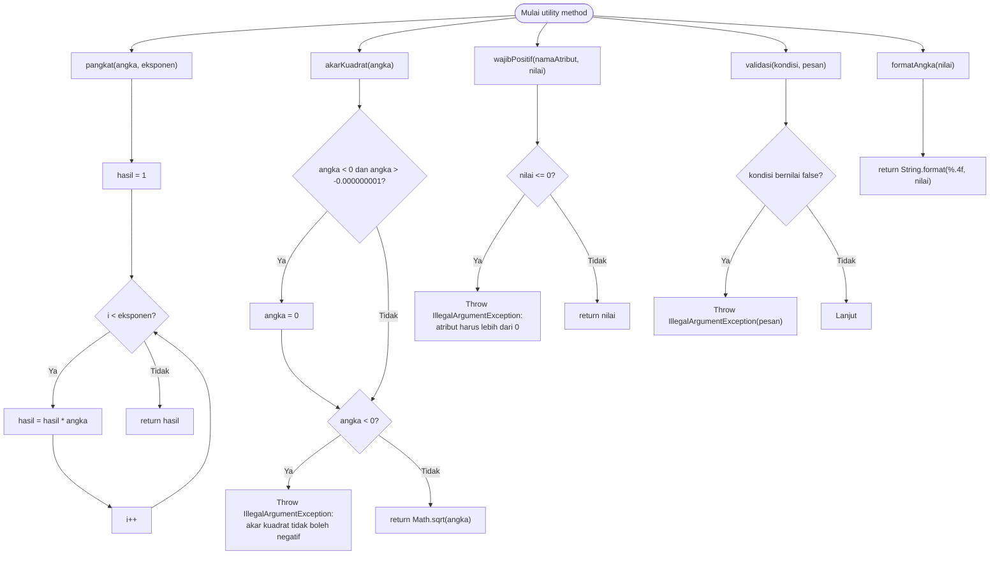

---

## 2. Elips.java

### Alur Constructor

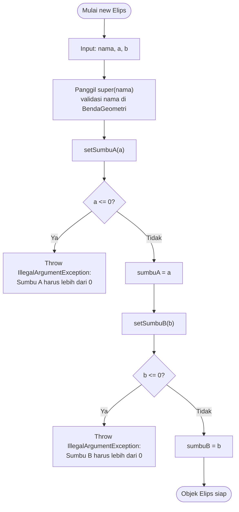

### Alur Perhitungan Elips

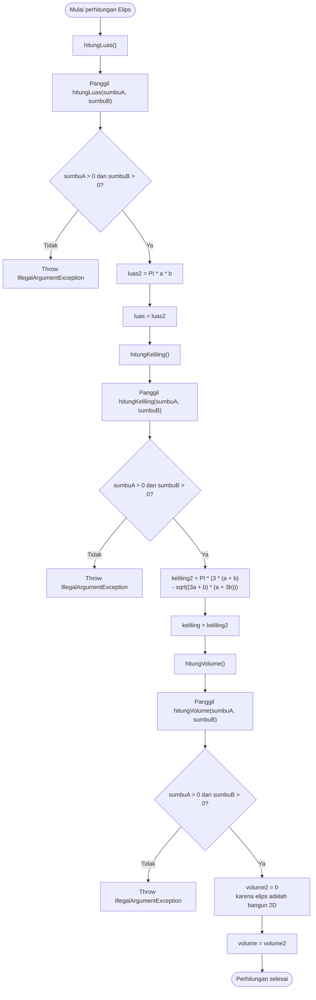

### Alur cetakInfo()

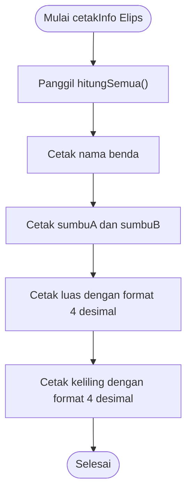

---

## 3. KerucutDenganAlasElips.java

### Alur Constructor

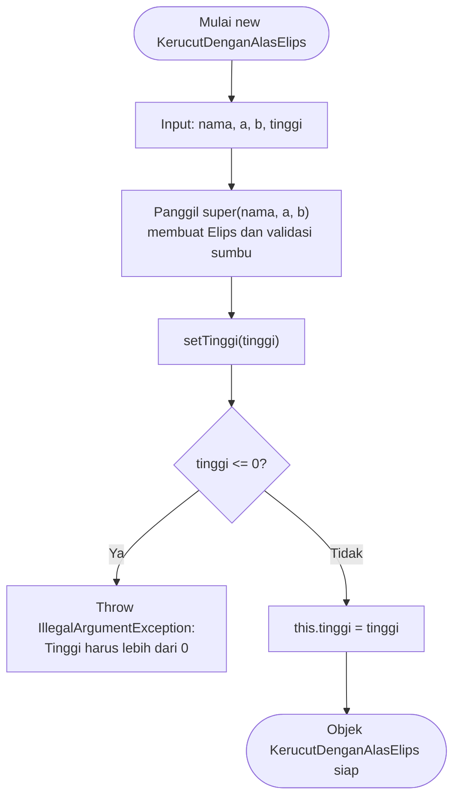

### Alur hitungLuas()

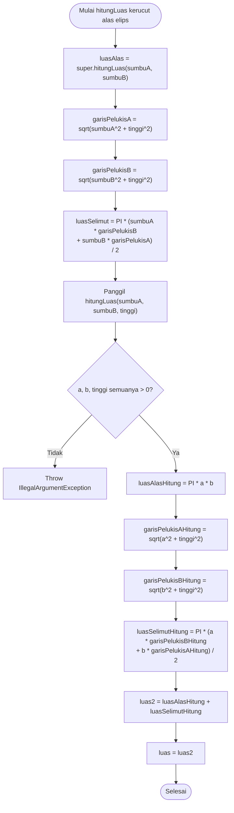

### Alur hitungKeliling() dan hitungVolume()

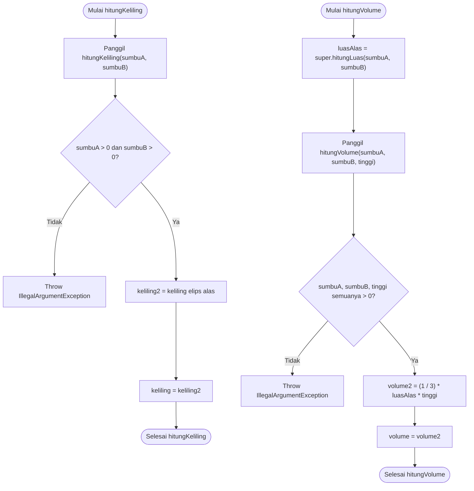

### Alur cetakInfo()

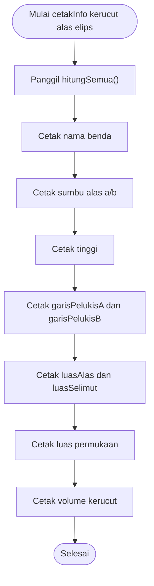

---

## 4. KerucutTerpancungDenganAlasElips.java

### Alur Constructor

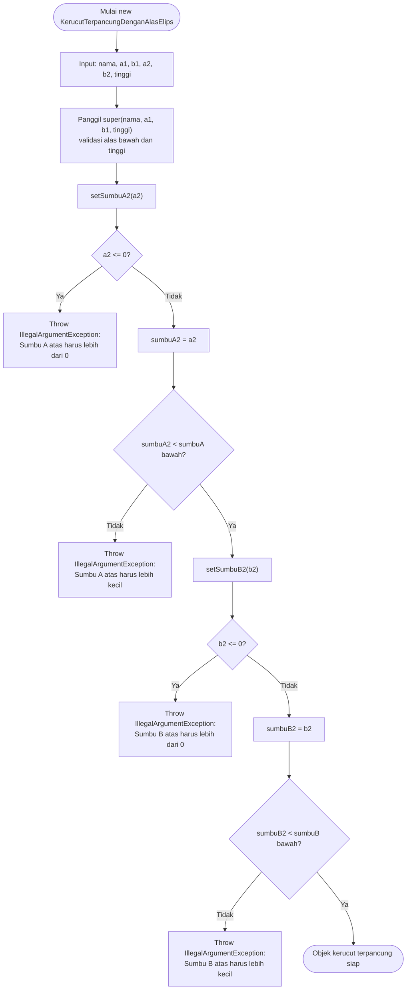

### Alur hitungLuas()

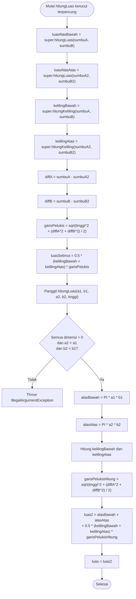

### Alur hitungKeliling() dan hitungVolume()

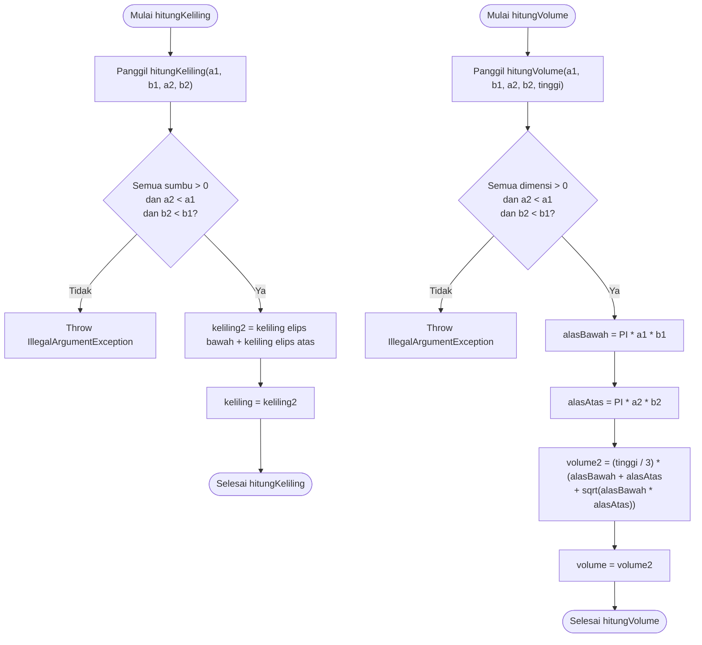

### Alur cetakInfo()

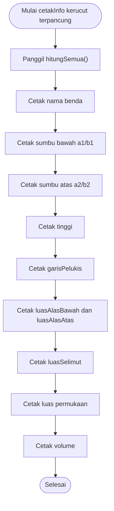

---

## 5. Bola.java

### Alur Constructor

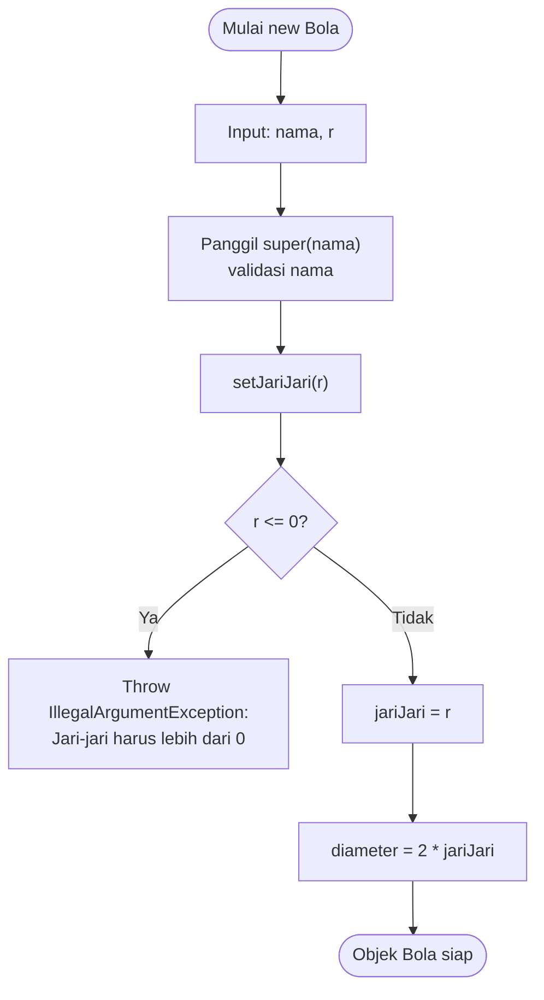

### Alur Perhitungan Bola

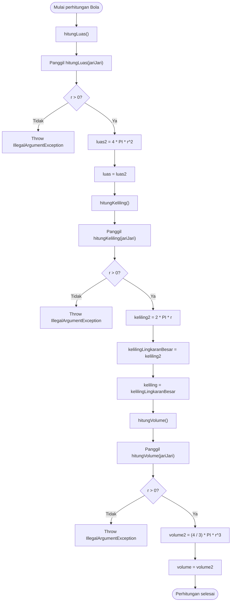

### Alur cetakInfo()

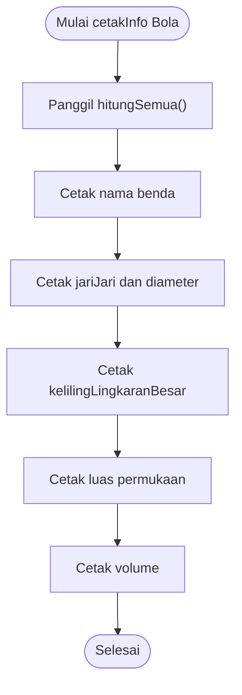

---

## 6. Cincin.java

### Alur Constructor

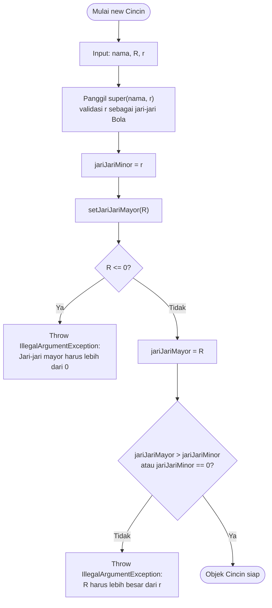

### Alur Perhitungan Cincin

```mermaid
flowchart TD
    A([Mulai perhitungan Cincin])

    A --> B["hitungLuas()"]
    B --> C["Panggil hitungLuas(R, r)"]
    C --> D{"R > 0 dan r > 0<br/>dan R > r?"}
    D -- Tidak --> E["Throw IllegalArgumentException"]
    D -- Ya --> F["luas2 = 4 * PI^2 * R * r"]
    F --> G["luas = luas2"]

    G --> H["hitungKeliling()"]
    H --> I["Panggil hitungKeliling(R)"]
    I --> J{"R > 0?"}
    J -- Tidak --> K["Throw IllegalArgumentException"]
    J -- Ya --> L["keliling2 = 2 * PI * R<br/>menggunakan Bola.hitungKeliling"]
    L --> M["keliling = keliling2"]

    M --> N["hitungVolume()"]
    N --> O["Panggil hitungVolume(R, r)"]
    O --> P{"R > 0 dan r > 0<br/>dan R > r?"}
    P -- Tidak --> Q["Throw IllegalArgumentException"]
    P -- Ya --> R["volume2 = 2 * PI^2 * R * r^2"]
    R --> S["volume = volume2"]
    S --> T([Perhitungan selesai])
```

### Alur Setter Minor dan cetakInfo()

```mermaid
flowchart TD
    A([Mulai setJariJariMinor(r)])
    B["Panggil super.setJariJari(r)"]
    C{"r <= 0?"}
    D["Throw IllegalArgumentException"]
    E["jariJariMinor = r"]
    F{"jariJariMayor == 0<br/>atau jariJariMayor > jariJariMinor?"}
    G["Throw IllegalArgumentException:<br/>R harus lebih besar dari r"]
    H([Setter selesai])

    A --> B --> C
    C -- Ya --> D
    C -- Tidak --> E --> F
    F -- Tidak --> G
    F -- Ya --> H

    I([Mulai cetakInfo Cincin])
    J["Panggil hitungSemua()"]
    K["Cetak nama benda"]
    L["Cetak jariJariMayor dan jariJariMinor"]
    M["Cetak keliling mayor"]
    N["Cetak luas cincin"]
    O["Cetak volume cincin"]
    P([Selesai])

    I --> J --> K --> L --> M --> N --> O --> P
```

---

## 7. Juring.java

### Alur Constructor

```mermaid
flowchart TD
    A([Mulai new Juring])
    B["Input: nama, r, h"]
    C["Panggil super(nama, r)<br/>validasi jari-jari bola"]
    D["setTinggiTopi(h)"]
    E{"h <= 0?"}
    F["Throw IllegalArgumentException:<br/>Tinggi topi harus lebih dari 0"]
    G{"tinggiTopi <= 2 * jariJari?"}
    H["Throw IllegalArgumentException:<br/>Tinggi topi maksimal 2 x jari-jari"]
    I["tinggiTopi = h"]
    J([Objek Juring siap])

    A --> B --> C --> D --> E
    E -- Ya --> F
    E -- Tidak --> I --> G
    G -- Tidak --> H
    G -- Ya --> J
```

### Alur Perhitungan Juring

```mermaid
flowchart TD
    A([Mulai perhitungan Juring])

    A --> B["hitungLuas()"]
    B --> C["jariJariAlas = sqrt(h * (2r - h))"]
    C --> D["Panggil hitungLuas(r, h)"]
    D --> E{"r > 0, h > 0,<br/>dan h <= 2r?"}
    E -- Tidak --> F["Throw IllegalArgumentException"]
    E -- Ya --> G["alas = sqrt(h * (2r - h))"]
    G --> H["luas2 = PI * alas^2 + PI * r * h"]
    H --> I["luas = luas2"]

    I --> J["hitungKeliling()"]
    J --> K["jariJariAlas = sqrt(h * (2r - h))"]
    K --> L["Panggil hitungKeliling(r, h)"]
    L --> M{"r > 0, h > 0,<br/>dan h <= 2r?"}
    M -- Tidak --> N["Throw IllegalArgumentException"]
    M -- Ya --> O["alas = sqrt(h * (2r - h))"]
    O --> P{"alas == 0?"}
    P -- Ya --> Q["keliling2 = 0"]
    P -- Tidak --> R["keliling2 = 2 * PI * alas"]
    Q --> S["keliling = keliling2"]
    R --> S

    S --> T["hitungVolume()"]
    T --> U["Panggil hitungVolume(r, h)"]
    U --> V{"r > 0, h > 0,<br/>dan h <= 2r?"}
    V -- Tidak --> W["Throw IllegalArgumentException"]
    V -- Ya --> X["volume2 = (2 / 3) * PI * r^2 * h"]
    X --> Y["volume = volume2"]
    Y --> Z([Perhitungan selesai])
```

### Alur cetakInfo()

```mermaid
flowchart TD
    A([Mulai cetakInfo Juring])
    B["Panggil hitungSemua()"]
    C["Cetak nama benda"]
    D["Cetak jariJari dan tinggiTopi"]
    E["Cetak jariJariAlas"]
    F["Cetak keliling alas"]
    G["Cetak luas juring"]
    H["Cetak volume juring"]
    I([Selesai])

    A --> B --> C --> D --> E --> F --> G --> H --> I
```

---

## 8. Tabung.java

### Alur Constructor

```mermaid
flowchart TD
    A([Mulai new Tabung])
    B["Input: nama, r, tinggi"]
    C["Panggil super(nama, r)<br/>validasi jari-jari alas"]
    D["setTinggi(tinggi)"]
    E{"tinggi <= 0?"}
    F["Throw IllegalArgumentException:<br/>Tinggi harus lebih dari 0"]
    G["this.tinggi = tinggi"]
    H([Objek Tabung siap])

    A --> B --> C --> D --> E
    E -- Ya --> F
    E -- Tidak --> G --> H
```

### Alur Perhitungan Tabung

```mermaid
flowchart TD
    A([Mulai perhitungan Tabung])

    A --> B["hitungLuas()"]
    B --> C["luasAlas = PI * r^2"]
    C --> D["luasSelimut = 2 * PI * r * tinggi"]
    D --> E["Panggil hitungLuas(r, tinggi)"]
    E --> F{"r > 0 dan tinggi > 0?"}
    F -- Tidak --> G["Throw IllegalArgumentException"]
    F -- Ya --> H["luasAlasHitung = PI * r^2"]
    H --> I["luasSelimutHitung = 2 * PI * r * tinggi"]
    I --> J["luas2 = 2 * luasAlasHitung + luasSelimutHitung"]
    J --> K["luas = luas2"]

    K --> L["hitungKeliling()"]
    L --> M["Panggil hitungKeliling(r)"]
    M --> N{"r > 0?"}
    N -- Tidak --> O["Throw IllegalArgumentException"]
    N -- Ya --> P["keliling2 = 2 * PI * r"]
    P --> Q["kelilingLingkaranBesar = keliling2"]
    Q --> R["keliling = kelilingLingkaranBesar"]

    R --> S["hitungVolume()"]
    S --> T["luasAlas = PI * r^2"]
    T --> U["Panggil hitungVolume(r, tinggi)"]
    U --> V{"r > 0 dan tinggi > 0?"}
    V -- Tidak --> W["Throw IllegalArgumentException"]
    V -- Ya --> X["volume2 = PI * r^2 * tinggi"]
    X --> Y["volume = volume2"]
    Y --> Z([Perhitungan selesai])
```

### Alur cetakInfo()

```mermaid
flowchart TD
    A([Mulai cetakInfo Tabung])
    B["Panggil hitungSemua()"]
    C["Cetak nama benda"]
    D["Cetak jari-jari alas dan tinggi"]
    E["Cetak luasAlas dan luasSelimut"]
    F["Cetak luas permukaan"]
    G["Cetak volume tabung"]
    H([Selesai])

    A --> B --> C --> D --> E --> F --> G --> H
```

---

## 9. Tembereng.java

### Alur Constructor

```mermaid
flowchart TD
    A([Mulai new Tembereng])
    B["Input: nama, r, h"]
    C["Panggil super(nama, r)<br/>validasi jari-jari bola"]
    D["setTinggiTopi(h)"]
    E{"h <= 0?"}
    F["Throw IllegalArgumentException:<br/>Tinggi topi harus lebih dari 0"]
    G{"tinggiTopi <= 2 * jariJari?"}
    H["Throw IllegalArgumentException:<br/>Tinggi topi maksimal 2 x jari-jari"]
    I["tinggiTopi = h"]
    J([Objek Tembereng siap])

    A --> B --> C --> D --> E
    E -- Ya --> F
    E -- Tidak --> I --> G
    G -- Tidak --> H
    G -- Ya --> J
```

### Alur Perhitungan Tembereng

```mermaid
flowchart TD
    A([Mulai perhitungan Tembereng])

    A --> B["hitungLuas()"]
    B --> C["jariJariAlas = sqrt(h * (2r - h))"]
    C --> D["luasSelimut = 2 * PI * r * h"]
    D --> E["luasAlas = PI * jariJariAlas^2"]
    E --> F["Panggil hitungLuas(r, h)"]
    F --> G{"r > 0, h > 0,<br/>dan h <= 2r?"}
    G -- Tidak --> H["Throw IllegalArgumentException"]
    G -- Ya --> I["alas = sqrt(h * (2r - h))"]
    I --> J["luas2 = 2 * PI * r * h + PI * alas^2"]
    J --> K["luas = luas2"]

    K --> L["hitungKeliling()"]
    L --> M["jariJariAlas = sqrt(h * (2r - h))"]
    M --> N["Panggil hitungKeliling(r, h)"]
    N --> O{"r > 0, h > 0,<br/>dan h <= 2r?"}
    O -- Tidak --> P["Throw IllegalArgumentException"]
    O -- Ya --> Q["alas = sqrt(h * (2r - h))"]
    Q --> R{"alas == 0?"}
    R -- Ya --> S["keliling2 = 0"]
    R -- Tidak --> T["keliling2 = 2 * PI * alas"]
    S --> U["keliling = keliling2"]
    T --> U

    U --> V["hitungVolume()"]
    V --> W["Panggil hitungVolume(r, h)"]
    W --> X{"r > 0, h > 0,<br/>dan h <= 2r?"}
    X -- Tidak --> Y["Throw IllegalArgumentException"]
    X -- Ya --> Z["volume2 = (PI * h^2 / 3) * (3r - h)"]
    Z --> AA["volume = volume2"]
    AA --> AB([Perhitungan selesai])
```

### Alur cetakInfo()

```mermaid
flowchart TD
    A([Mulai cetakInfo Tembereng])
    B["Panggil hitungSemua()"]
    C["Cetak nama benda"]
    D["Cetak jari-jari bola dan tinggiTopi"]
    E["Cetak jariJariAlas"]
    F["Cetak keliling alas"]
    G["Cetak luasSelimut dan luasAlas"]
    H["Cetak luas tembereng"]
    I["Cetak volume tembereng"]
    J([Selesai])

    A --> B --> C --> D --> E --> F --> G --> H --> I --> J
```
