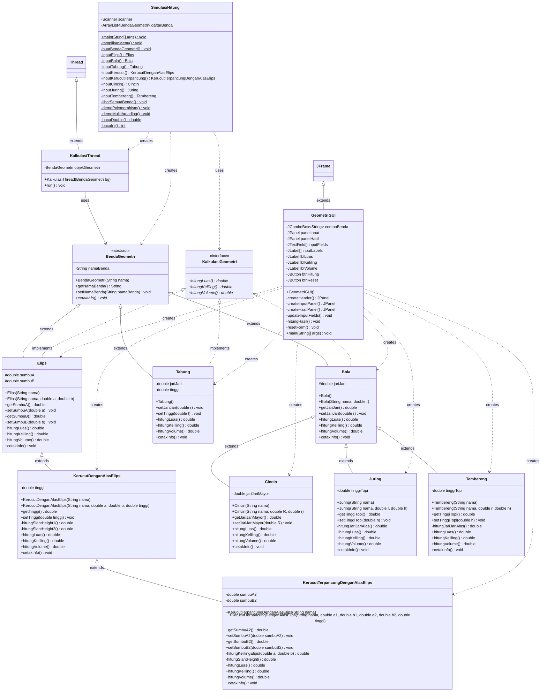
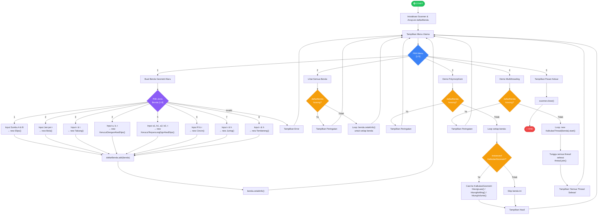
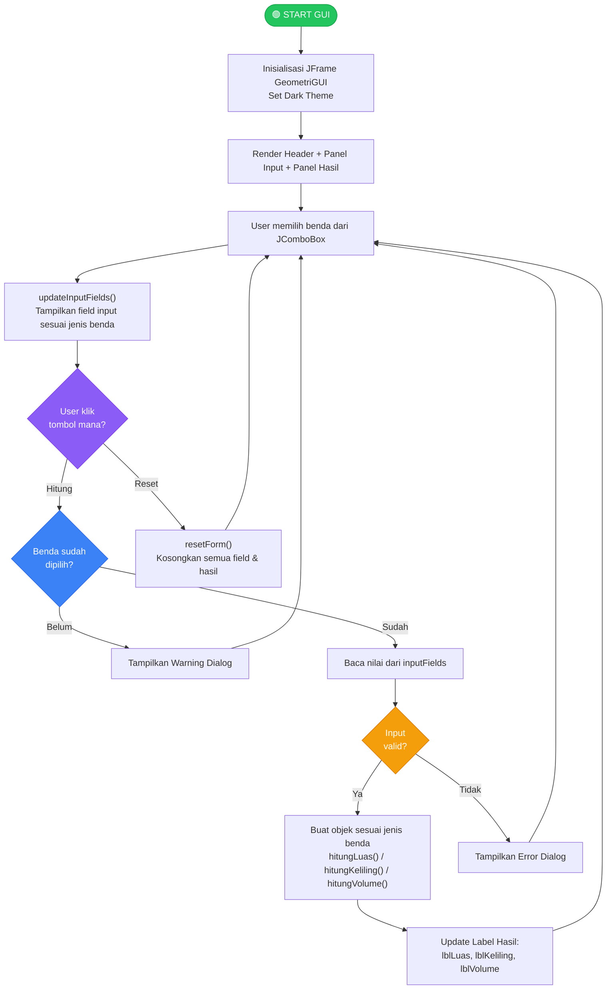
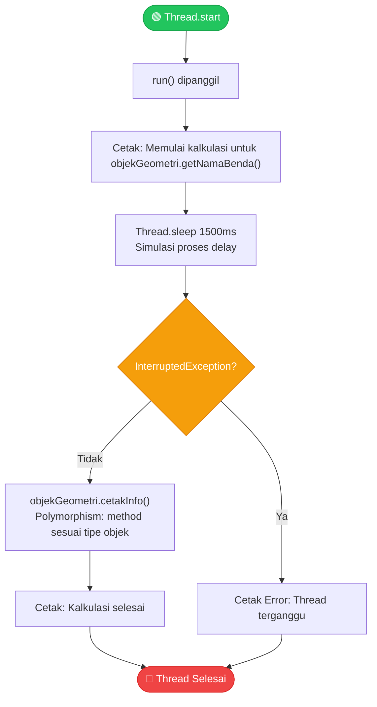
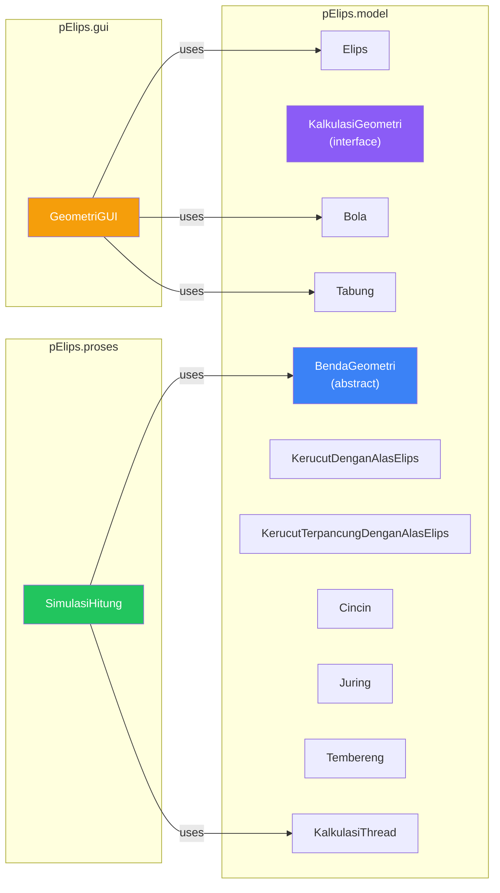

# Flowchart & UML Class Diagram
## Projek Akhir PBO 2 — Simulasi Hitung Benda Geometri Elips

---

## 1. UML Class Diagram

Diagram berikut menggambarkan seluruh hierarki class, interface, atribut, method, dan relasi antar class dalam project.

### Keterangan Notasi UML

| Simbol | Arti |
|--------|------|
| `+` | `public` |
| `-` | `private` |
| `#` | `protected` |
| `$` | `static` |
| `*` | `abstract` |
| `<<abstract>>` | Abstract Class |
| `<<interface>>` | Interface |
| `<\|--` (garis penuh) | Inheritance (`extends`) |
| `<\|..` (garis putus) | Implementation (`implements`) |
| `-->` | Association / Uses |
| `..>` | Dependency / Creates |

### Ringkasan Hierarki Inheritance

| Level | Class | Parent |
|-------|-------|--------|
| 0 | `BendaGeometri` *(abstract)* | — |
| 1 | `Elips` | `BendaGeometri` |
| 1 | `Bola` | `BendaGeometri` |
| 1 | `Tabung` | `BendaGeometri` |
| 2 | `KerucutDenganAlasElips` | `Elips` |
| 2 | `Cincin` | `Bola` |
| 2 | `Juring` | `Bola` |
| 2 | `Tembereng` | `Bola` |
| 3 | `KerucutTerpancungDenganAlasElips` | `KerucutDenganAlasElips` |

---

## 2. Flowchart — Alur Program Utama (SimulasiHitung)

---

## 3. Flowchart — Alur GUI (GeometriGUI)

---

## 4. Flowchart — Alur Multithreading (KalkulasiThread)

---

## 5. Penerapan 5 Pilar PBO dalam Diagram

| Pilar PBO | Penjelasan di Diagram |
|-----------|----------------------|
| **Encapsulation** | Atribut `private` (`-`) dan `protected` (`#`) dengan getter/setter `public` (`+`) di setiap class |
| **Inheritance** | Garis `extends`: BendaGeometri → Elips → KerucutDenganAlasElips → KerucutTerpancungDgnAlasElips, dan BendaGeometri → Bola → Cincin/Juring/Tembereng |
| **Overloading** | Setiap subclass memiliki 2 constructor: default (1 parameter) dan lengkap (parameter penuh) |
| **Overriding & Polymorphism** | Method `hitungLuas()`, `hitungKeliling()`, `hitungVolume()`, `cetakInfo()` di-override di setiap subclass. Di flowchart, terlihat pada loop Polymorphism yang memanggil method yang sama untuk objek berbeda |
| **Multithreading** | `KalkulasiThread extends Thread` menjalankan `cetakInfo()` secara paralel dengan `Thread.sleep()` di flowchart multithreading |

---

## 6. Package Diagram

