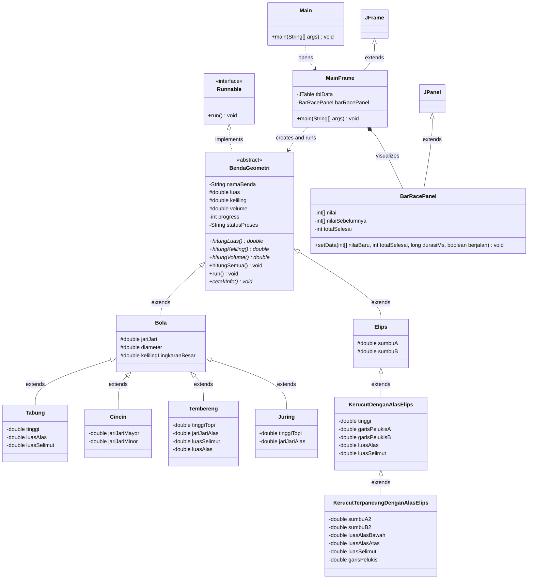
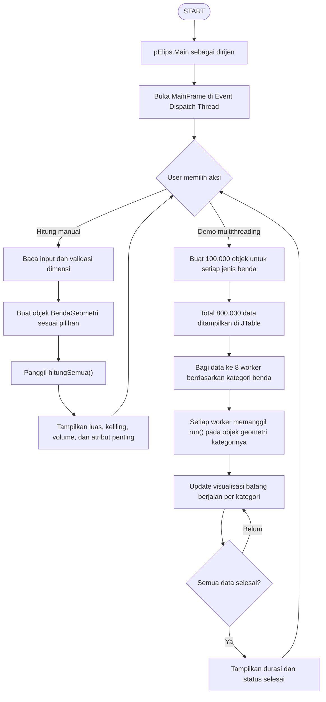

# Flowchart dan UML Class Diagram

## UML Class Diagram

## Flowchart Program Utama

## Catatan Revisi

- Interface kalkulasi terpisah dihapus; method hitung berada di abstract class `BendaGeometri`.
- Class thread terpisah dihapus; proses paralel memakai objek geometri sebagai `Runnable`.
- Multithreading memakai `Runnable` dari setiap objek geometri.
- `Tabung` sekarang mengikuti struktur revisi: `BendaGeometri -> Bola -> Tabung`.
- GUI utama berada di package `pElips.gui`.
