# Flowchart Per Class untuk Laporan

Dokumen ini dibuat per class agar mudah dimasukkan ke laporan. Setiap bagian dapat dijadikan satu halaman tersendiri. Flowchart hanya memuat alur yang penting: constructor, validasi, perhitungan utama, proses `run()`, GUI, dan multithreading.

---

## Page 1 - `BendaGeometri` (Abstract Class)

Fokus: alur umum semua benda geometri dan proses `Runnable`.

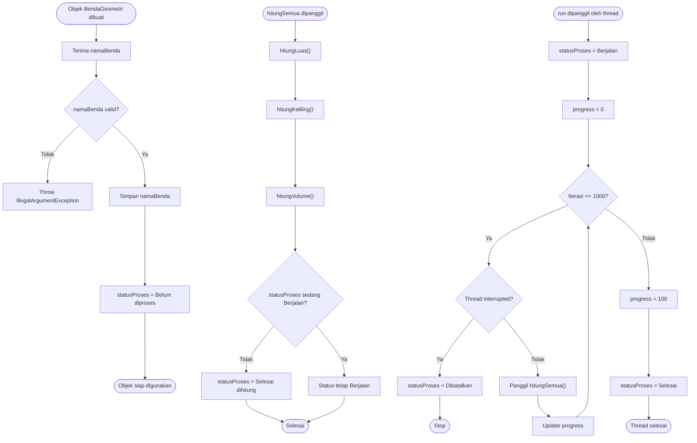

---

## Page 2 - `Elips`

Fokus: validasi sumbu dan perhitungan benda 2D.

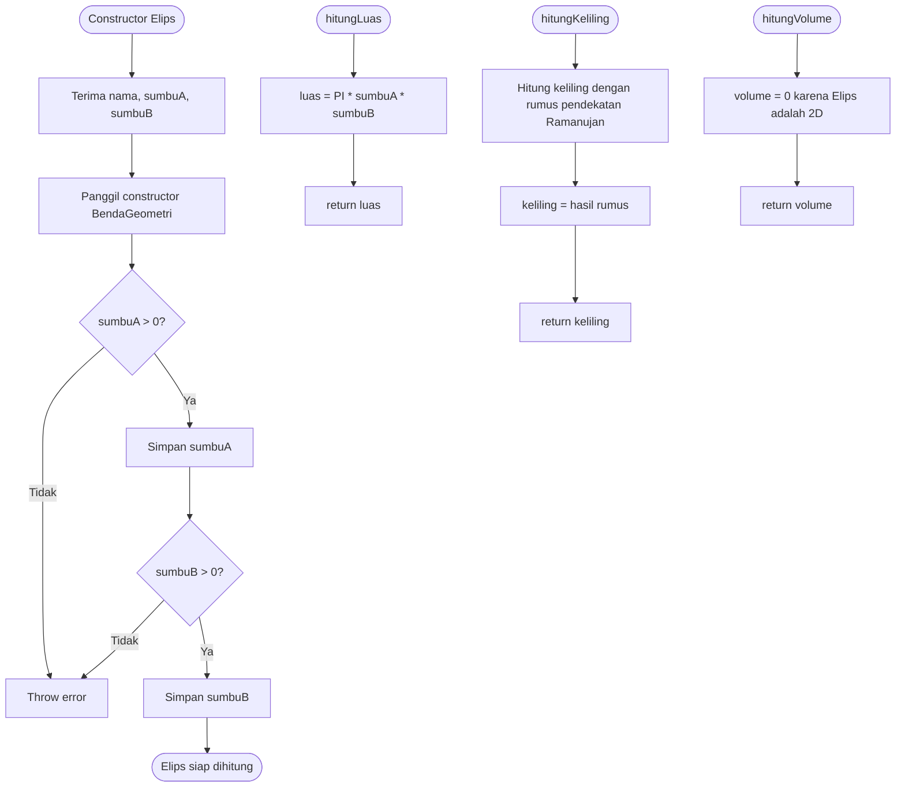

---

## Page 3 - `KerucutDenganAlasElips`

Fokus: turunan `Elips`, menghitung luas permukaan dan volume kerucut alas elips.

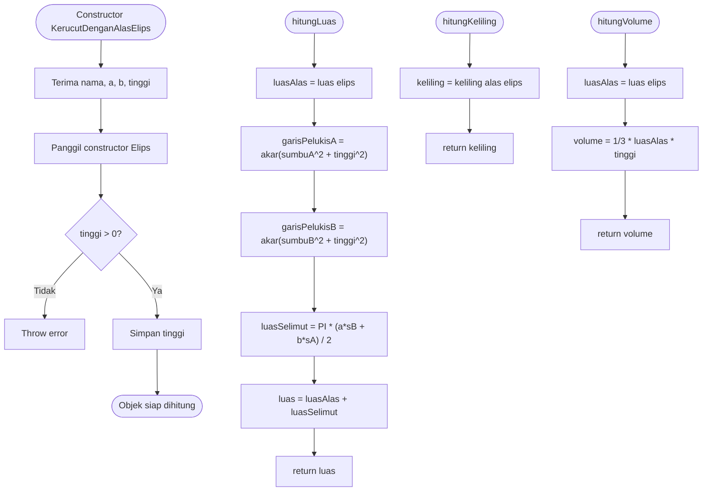

---

## Page 4 - `KerucutTerpancungDenganAlasElips`

Fokus: validasi alas atas lebih kecil, menghitung frustum alas elips.

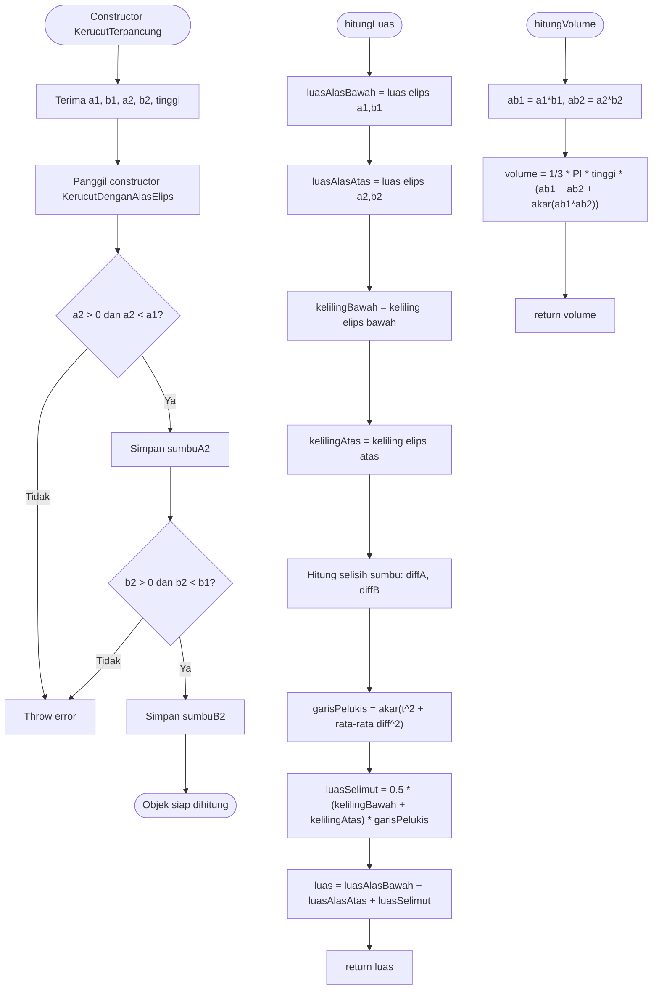

---

## Page 5 - `Bola`

Fokus: parent untuk juring, tembereng, cincin, dan tabung.

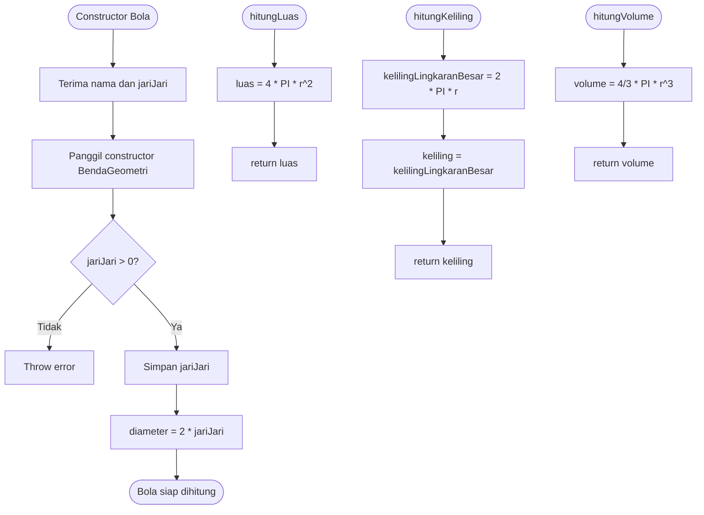

---

## Page 6 - `Tabung`

Fokus: turunan `Bola`, memakai `jariJari` sebagai alas tabung.

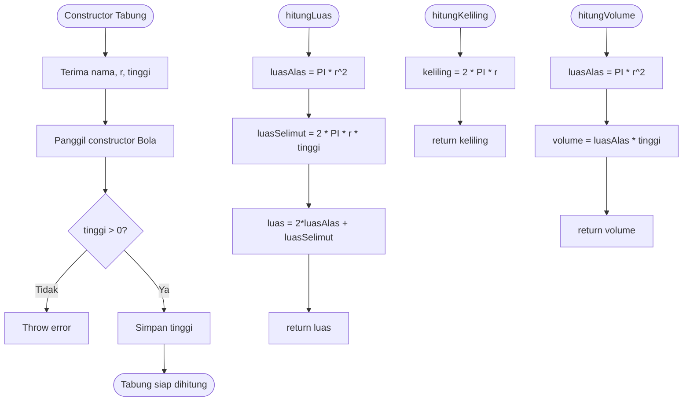

---

## Page 7 - `Cincin`

Fokus: validasi radius mayor dan minor.

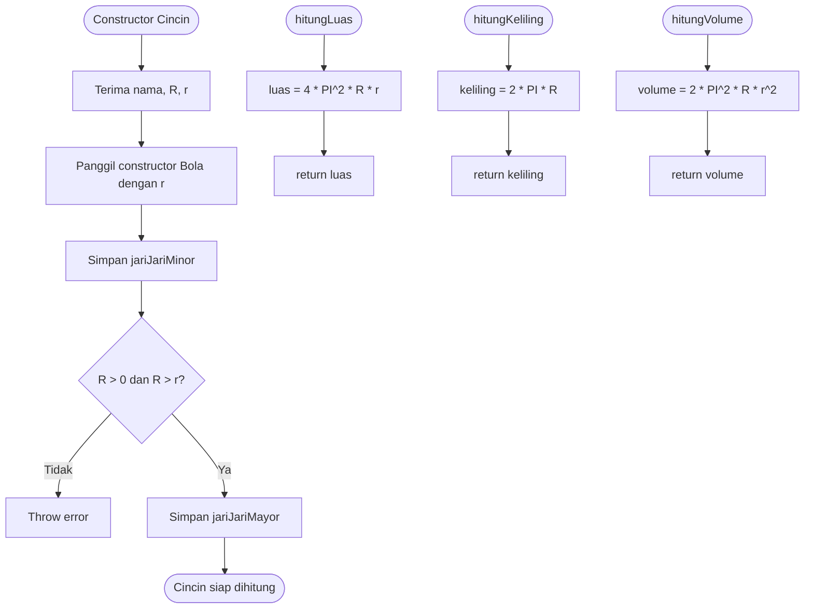

---

## Page 8 - `Juring`

Fokus: validasi tinggi topi dan perhitungan juring bola.

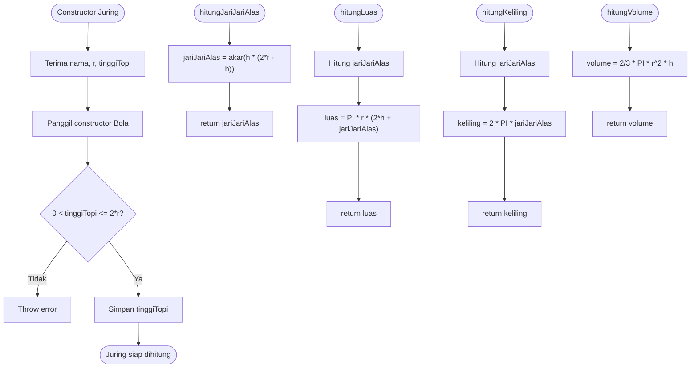

---

## Page 9 - `Tembereng`

Fokus: validasi tinggi topi dan perhitungan tembereng bola.

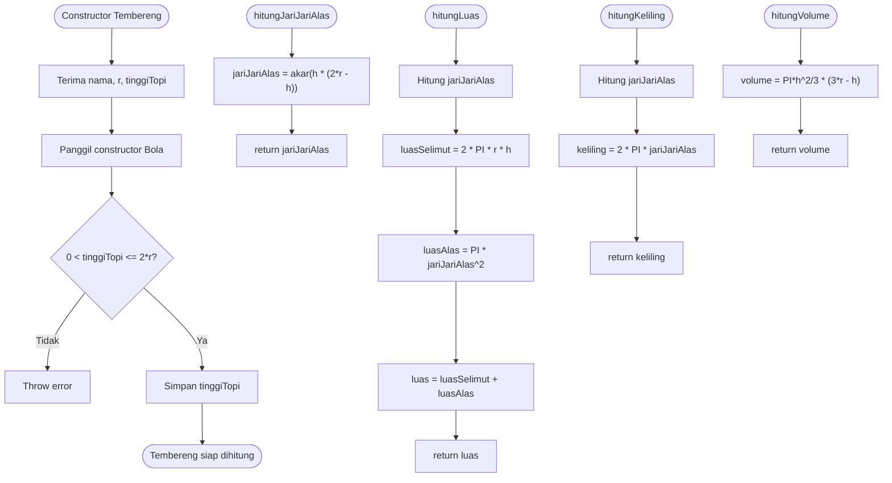

---

## Page 10 - `Main`

Fokus: class utama sebagai dirijen aplikasi.

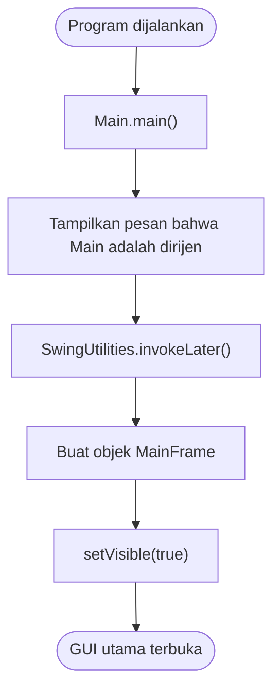

---

## Page 11 - `MainFrame`

Fokus: alur GUI untuk input manual dan demo multithreading.

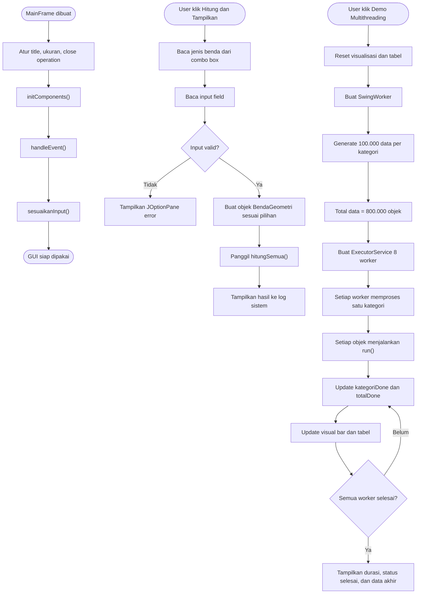

---

## Page 12 - `SimulasiHitung`

Fokus: alur console/CLI sebagai alternatif demonstrasi.

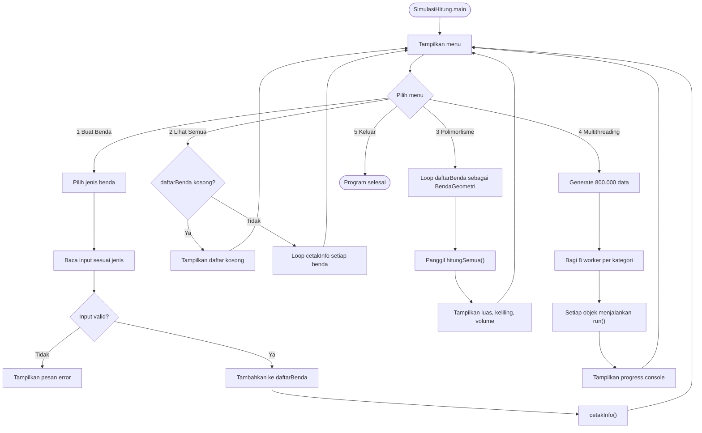

